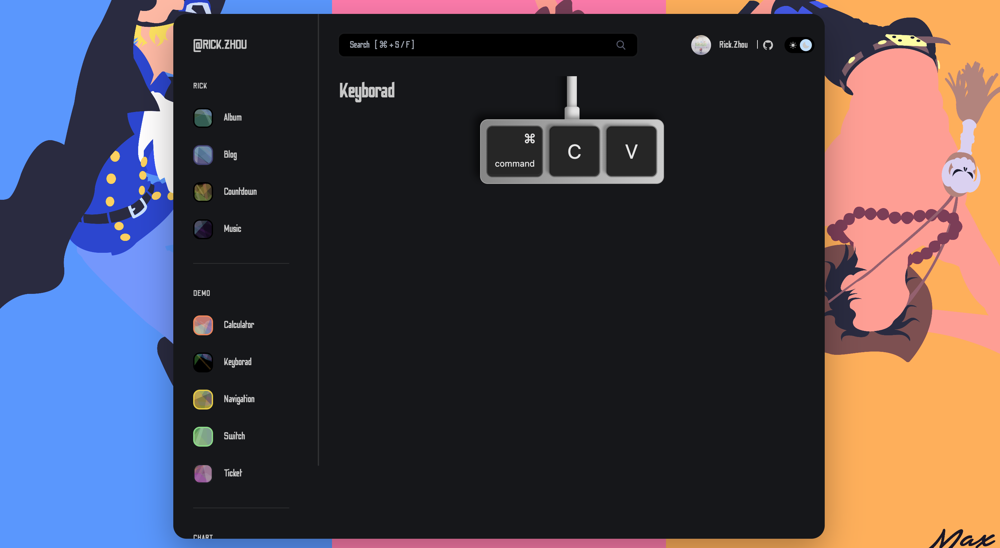
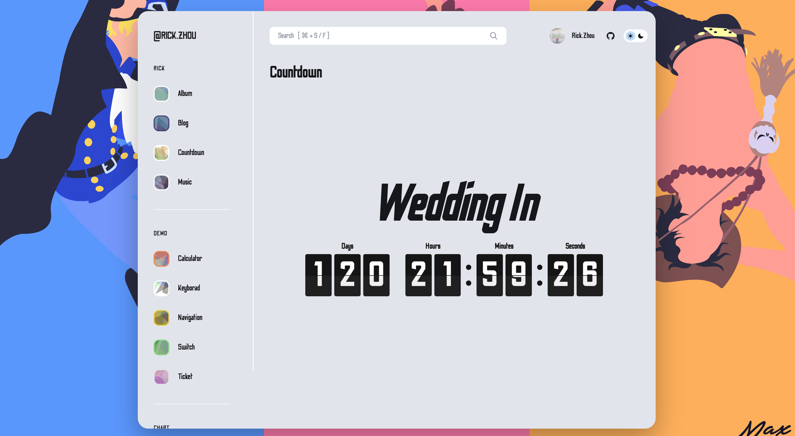
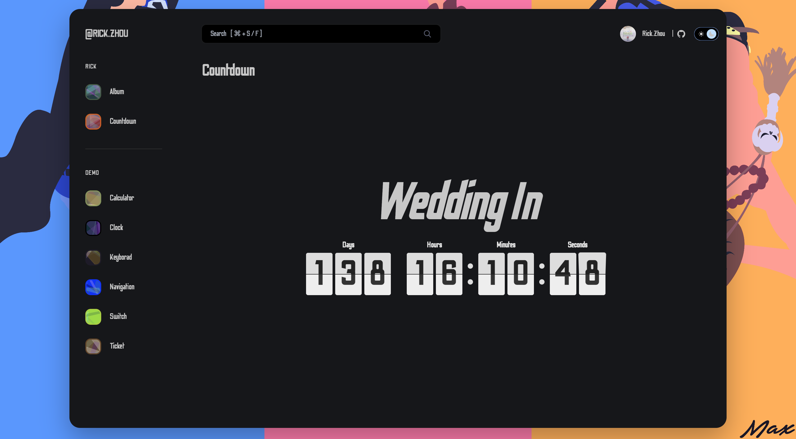
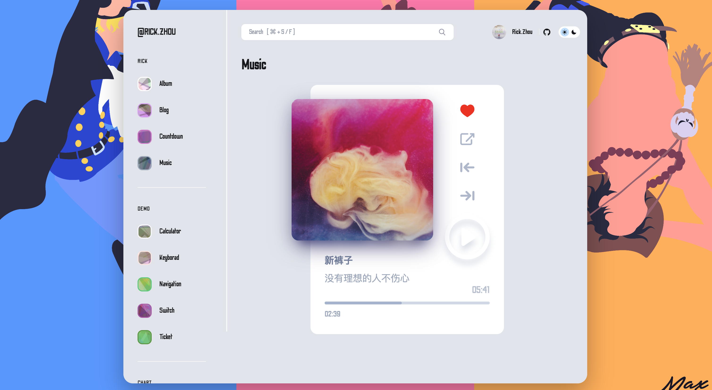
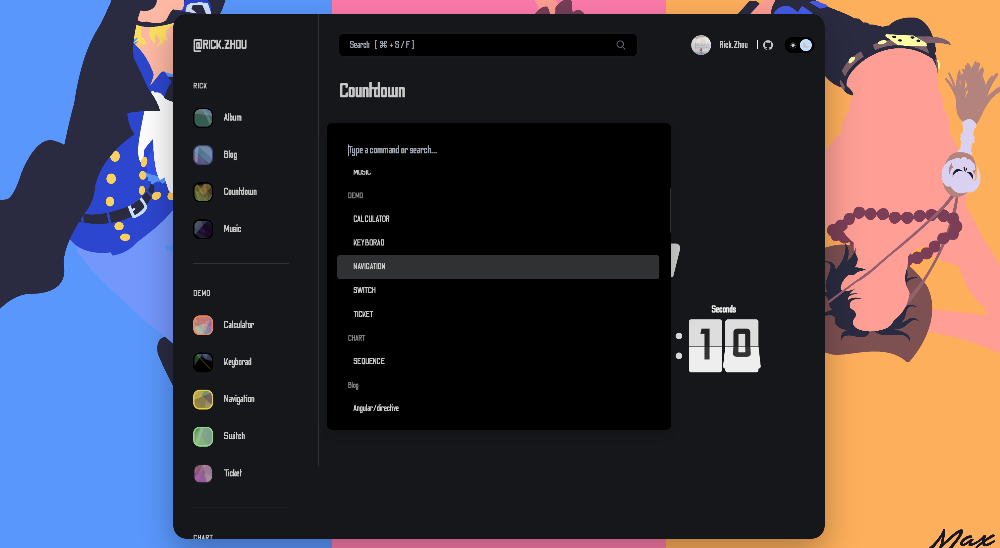
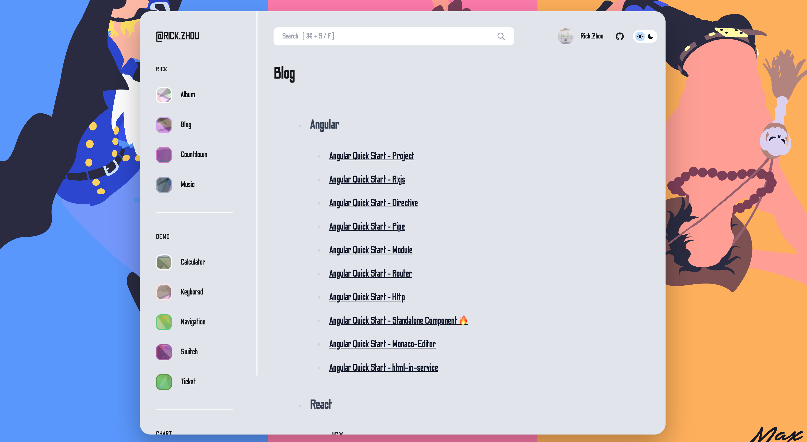
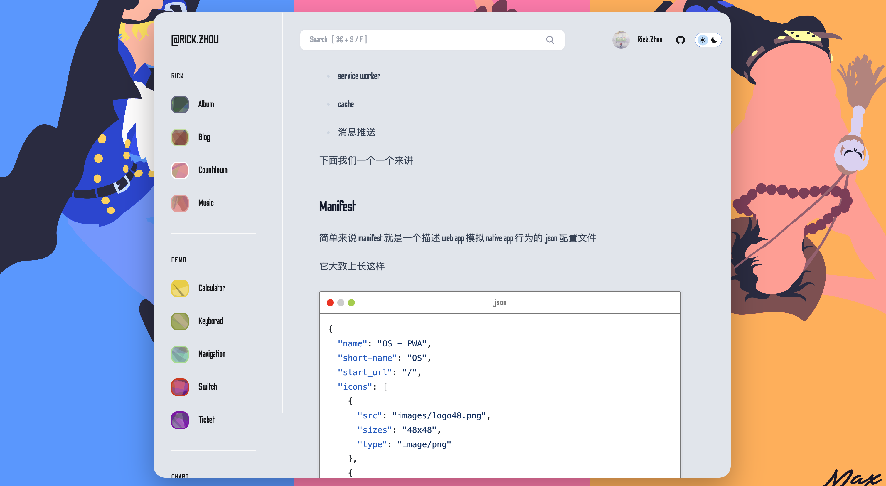
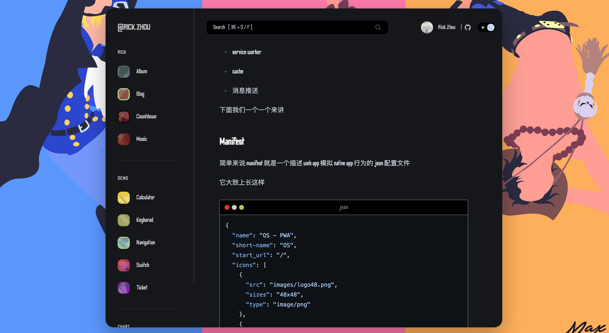
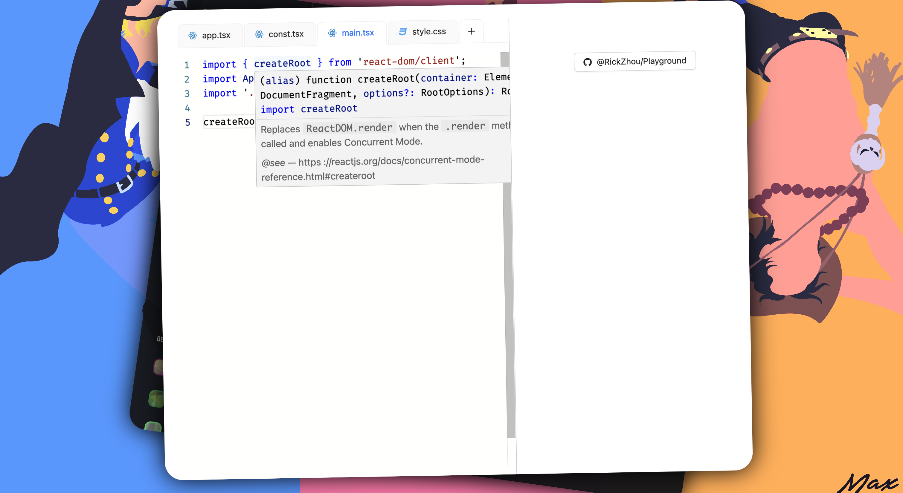

<h1 align="center">ONE PIECE REACT</h1>

  

  
  
  
  
  
  

## 🌈 Time Machine

### 2021

- [x] Graduation! 🥂 🧱 👷🏿‍♂️
- [x] Vue2 Developer 😀
- [x] React Developer 😍

### 2022

- [x] React Native Developer 😅

### 2023

- [x] Angular2.0+ Developer 🤔
- [x] React Developer 😅
- [x] Learn Java 😎
- [x] Get married 🥰

### 2024

- [x] Our little one has arrived! 🍼🧑‍🍼👩‍🍼

## 🌟 Blog

> https://rick-chou.github.io/one-piece-react/

