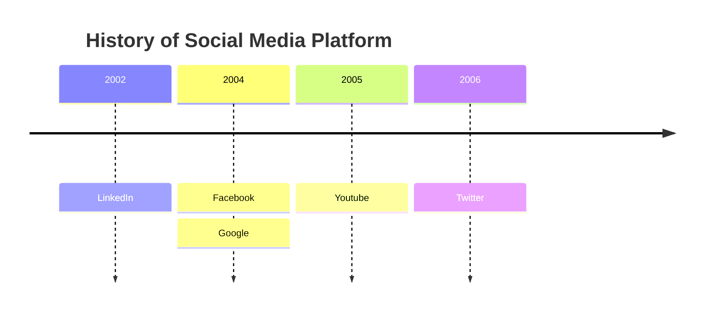

## Hello ~ This is {import.meta.env.RICK_AUTHOR}

### Codesandbox

<Codesandbox id="three-js-initial-forked-xokzl7" />

### Codepen

<Codepen id="LYVqMYb" />

### Mermaid



### Sequence Chart

<SequenceChart msc={
`
msc {
    hscale="1.1",
    width=${window.innerWidth * 0.4},
    wordwraparcs=true;

    Client [url="Client"],
    WebFE [url="WebFE"],
    RA [url="RA"],
    SA [url="SA"],
    VA [url="Client"];

    Client -> WebFE [label="authorizationRequest", url="this is a authorizationRequest"];
    WebFE rbox WebFE [label="look up authorization based on nonce"];
    WebFE rbox WebFE [label="verify authorization signature"];
    WebFE -> RA [label="UpdateAuthorization (Authorization)"];
    RA rbox RA [label="add responses to authorization"];
    RA -> SA [label="Update(Authorization.ID, Authorization)"];
    WebFE -> VA [label="UpdateValidations (Authorization)"];
    WebFE -> Client [label="defer (authorizationID)"];
    VA -> SA [label="Update (Authorization.ID, Authorization)"];
    VA -> RA [label="OnValidationUpdate (Authorization)"];
    RA rbox RA [label="check that validation sufficient"];
    RA rbox RA [label="finalize authorization"];
    RA -> SA [label="Update (Authorization.ID, Authorization)"];
    RA -> WebFE [label="OnAuthorizationUpdate(Authorization)"];
    Client -> WebFE [label="statusRequest"];
    WebFE >> Client [label="error / authorization"];
    }

`
} />

### Image


### Codeblock

```tsx filename="demo.tsx"
import ReactDOM from 'react-dom/client';
import { Provider } from 'react-redux';
import { RouterProvider } from 'react-router-dom';
import { PersistGate } from 'redux-persist/integration/react';
import './index.scss';
import { router } from './router';
import { persistor, store } from './store';

const RickBlog = () => {
  return (
    <Provider store={store}>
      <PersistGate loading={null} persistor={persistor}>
        <RouterProvider router={router} />
      </PersistGate>
    </Provider>
  );
};

ReactDOM.createRoot(document.getElementById('root')!).render(<RickBlog />);
```

### Quote

> This is a Quote

### Tag

`useState`
