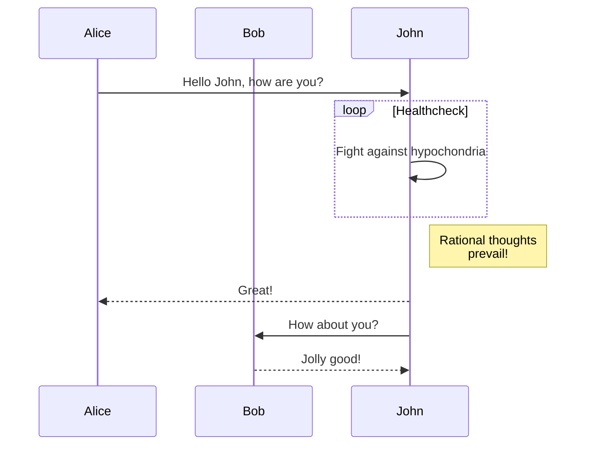

import { Mermaid } from 'mdx-mermaid/Mermaid';

<>
  <div className="text-2xl font-black">{import.meta.env.RICK_AUTHOR}‘ Blog</div>
</>

**You can Toggle the theme btn to view the theme**

## TODO LIST

- TODO

  - [x] DONE
  - [ ] TODO

## CODE BLOCK

````text
code block

```<language>
some code
```
````

````tsx filename="main.tsx"
```<language> filename="<filename>"
set filename
```;
````

## QUOTE

> Here is the quote

## MERMAID



<Mermaid
  chart={`
  mindmap
  root((mindmap))
    Origins
      Long history
      ::icon(fa fa-book)
      Popularisation
        British popular psychology author Tony Buzan
    Research
      On effectiveness<br/>and features
      On Automatic creation
        Uses
            Creative techniques
            Strategic planning
            Argument mapping
    Tools
      Pen and paper
      Mermaid
`}
/>
